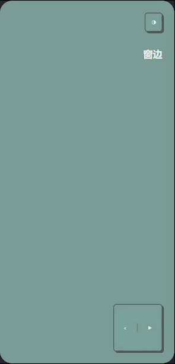
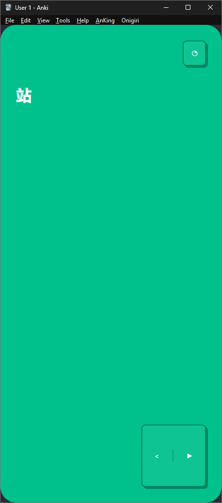
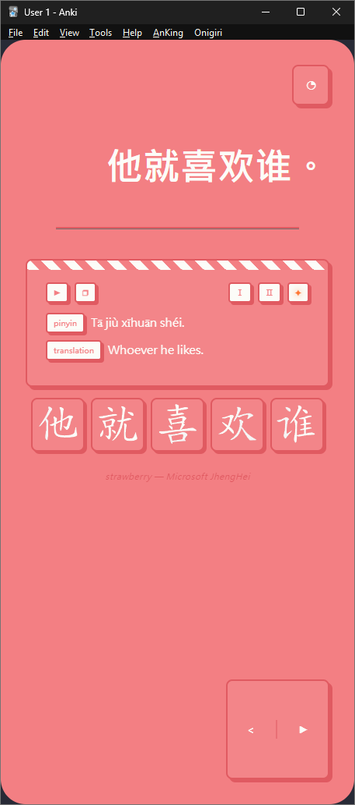
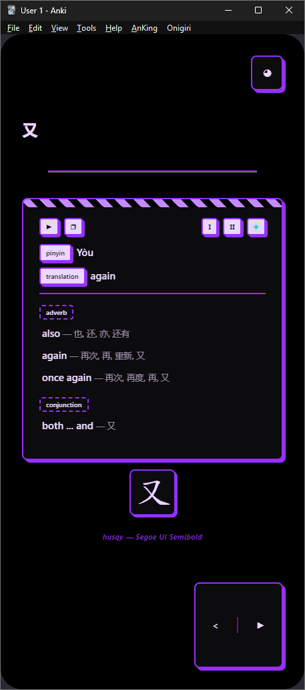
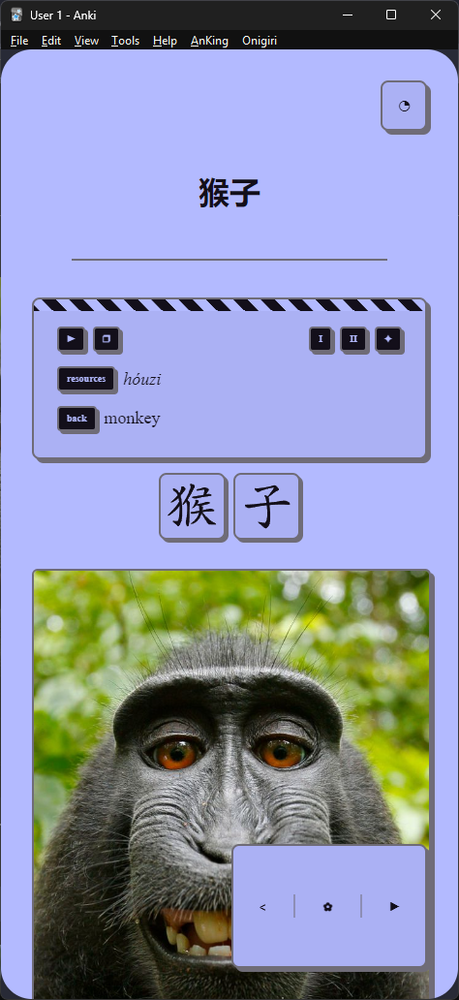

## 1. What is this
I am specifically providing a customized note type rather than a deck, as I have no intention of competing with the many high-quality decks already available.

  

This template eliminates visual pattern recognition by randomizing over 100 themes, fonts, and alignments to ensure you focus on reading rather than card shapes.

| Front | Light Mode | Dark Mode |
| :---: | :---: | :---: |
|  |  |  |

The Hanzi Writer integration provides animated stroke orders for Chinese and Japanese but only activates when it recognizes supported characters, making the template perfectly safe for general-purpose use. It includes on-card toggles for dark mode, font size, and audio, alongside Google Translate integration for quick lookups. 

  

## 2. What to expect

This outlines the fields and example content for a complete card, so you know exactly what to expect:

| Field Name | Example Content |
| :--------- | :----------------------------------------------------- |
| Front | 白天 |
| Back | daytime |
| Audio | [sound:白天_YunxiaNeural_313.mp3] |
| Back Audio | [sound:daytime_AriaNeural_148.mp3] |
| Resources | báitiān |
| Image |  |

For AnkiDroid users, I recommend using the new study screen with the frame style box and gesture-based navigation for the best experience. If the desktop version feels stuttery, try switching the video driver in your general preferences.

  
## 3. How to use
  
1. [Download the .apkg file](./basic_note_type.apkg?raw=true) and import it into Anki. The note type will be automatically added to your collection. Now if you have an existing deck that you would like to migrate to this template:
2. Open the Anki Browser.
3. Select the cards you wish to update.
4. Right-click and navigate to Notes > Change Note Type.
5. Select this new note type and map your old fields to the equivalent fields in this template.
